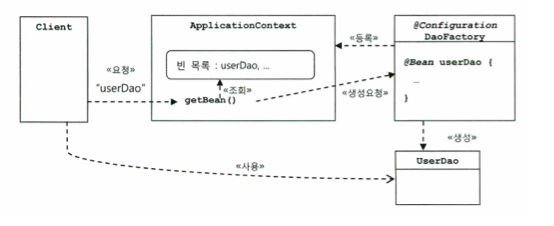

# Toby's Spring

## Design Pattern

### Template Method Pattern

상속을 통해서 슈퍼클래스의 기능을 확장할 때 사용되는 가장 대표적인 방법이다. 불변 기능은 슈퍼클래스에 만들어두고 변경이 잦거나 확장이 필요한 기능은 서브클래스에서 구현하도록 한다. 슈퍼 클래스에서는 미리 추상 메소드 또는 오버리아드 가능한 메소드를 정의하두고 이를 활용해 코드의 기본 알고리즘을 담고있는 템플릿 메소드를 만든다. 슈퍼클래스에서 디폴트 기능을 정의해두거나 비워두었다가 서브클래스에서 선택적으로 오버라이드 할 수 있도록 만들어둔 메소드를 훅 메소드라고 한다.

```java
// Super.java - 추상 클래스
public abstract class Super {
    
    public void templateMethod(){
        // basic code
        
        hookMethod(); // 선택적으로 오버라이드 가능한 훅 메소드
        abstractMethod(); // 필수적으로 구현해야하는 추상 메소드
    }
    
   	protected void hookMethod();
    public abstract void abstractMethod();
}
```

```java
// Sub1.java - 구현체
public class Sub1 extends Super {
    
    @Override
    protected void hookMethod() {
        ...
    }
    @Override
    public void abstractMethod() {
        ...
    }
}
```

#### 장단점

* 장점

  * 상속을 통해 관심사항이 다른 코드를 분리해내고, 서로 독립적을로 변경 또는 확장 할 수 있다.

* 단점

  * 자바는 클래스의 다중 상속을 허용하지 않기 때문에 후에 다른 목적의 상속이 불가능하다.
  * 슈퍼 클래스의 변화가 모든 서브클래스를 변경시킬 수 있기 때문에 이에 대한 후처리가 필요할 수 있다.

  * 확장된 메서드를 다른 비슷한 타입의 클래스에서 사용할 수 없으므로 중복 코드의 위험이 있다.

---

### Factory Method Pattern

상속을 통해 기능을 확장하게 하는 패턴. 슈퍼클래스 코드에서는 서브 클래스에서 구현할 메소드를 호출해서 필요한 타입의 오브젝트를 가져와 사용한다. 주로 인터페이스 타입으로 오브젝트를 리턴하므로 서브클래스에서 정확히 어떤 클래스의 오브젝트를 만들어 리턴할지는 슈퍼클래스에서는 알지 못한다.

#### Product

```java
public interface Super {
    void create();
}
```

```java
public Sub1 extends Super {
    @Override
    public void create() {
        ...
    }
}
```

#### Creator(Factory)

```java
// SuperFactory.java - 추상클래스로 정의, newInstance로 Super객체를 생성할 수 있다.
public abstract class SuperFactory {
    public Super newInstance() {
        Super s = createSuper();
        s.create();
        return s;
    }
    
    protected abstract Super createSuper();
}
```

```java
public class Sub1Factory extends SuperFactory {
    @Override
    protected Super createSuper() {
        return new Sub1();
    }
}
```

#### Client

```java
SuperFactory sub1Factory = new Sub1Factory();
Super super = sub1Factory.newInstance(); // 이 때, super는 Sub1 오브젝트이다.
```


팩토리 메서드 패턴의 장점은 확장 시 기존코드의 변경이 없어도 된다는 점이다. 만약 Sub2라는 Super 구현체가 새로 추가되어야 할 때 Product와 Creator만 새로 만들어주면 된다.

#### Product

```java
public class Sub2 implements Super {
    @Override
    public void create() {
        ...
    }
}
```

#### Creator(Factory)

```java
public class Sub2Factory extends SuperFactory {
    @Override
    protected Super createSuper() {
        return new Sub2();
    }
}
```

이렇게 두개를 추가해준다면 클라이언트 입장에서는 다음과 같이 사용할 수 있습니다.

```java
SuperFactory sub2Factory = new Sub2Factory();
Super super = sub2Factory.newInstance(); // 이 때, super는 Sub2 오브젝트이다.
```


#### 장단점 

- 장점: Factory Method 패턴의 가장 큰 장점은 지금까지 본 것처럼 수정에 닫혀있고 확장에는 열려있는 OCP 원칙을 지킬 수 있다는 점입니다.
- 단점: 간단한 기능을 사용할 때보다 많은 클래스를 정의해야 하기 때문에 코드량이 증가합니다.


## IoC & DI

### IoC (Inversion of Control, 제어의 역전)

일반적으로 프로그램의 흐름은 main() 메소드와 같이 프로그램이 시작되는 지점에서 다음에 사용할 오브젝트를 결정하고 생성하고, 메서드를 호출하는 등의 작업이 반복된다. 이때, 각 오브젝트는 프로그램 흐름을 경정하거나 사용할 오브젝트를 구성하는 작업에 능동적으로 참여한다. 

IoC란 이런 제어 흐름을 거꾸로 뒤집어 오브젝트가 자신이 사용할 오브젝트를 스스로 선택하지 않고 생성 및 제어에 대한 권한을 자신이 아닌 다른 대상, 스프링에서는 ApplicationContext에 위임한다. 스프링에서는 엔트리포인트인 main() 메서드를 제외한 모든 오브젝트는 해당 ApplicationContext 오브젝트에 의해 결정되어지고 만들어진다.


### 1.5 스프링의 IoC

#### 1.5.1 Object Factory를 이용한 Spring IoC

* 빈(bean) - Spring에서는 스프링이 제어권을 가지고 직접 만들고 관계를 부여하는 오브젝트.

* 빈 팩토리(Bean Factory) - 빈의 생성과 관계설정 같은 제어를 담당하는 IoC 오브젝트.
* Application Context - IoC방식을 따라 만들어진 빈 팩토리의 일종으로 BeanFactory객체를 상속받아 확장한 인터페이스다. Configuration을 참고해서 빈의 생성, 관계 설정 등의 제어 작업을 총괄한다. (= IoC 컨테이너)

#### 1.5.2 Application Context의 동작방식

* Application Context (= IoC Container, Spring Container)는 ApplicationContext 인터페이스를 구현하며 BeanFactory 인터페이스를 상속받기 때문에 빈 팩토리의 확장이다.



* Application Context는 빈팩토리 설정 정보에 존재하는 @Bean 정보를 기반으로 빈 목록을 만든다. 클라이언트가 해당 빈을 호출하면 자신의 빈 목록에서 요청한 이름이 있는지 찾고, 있다면 빈을 생성하는 메소드를 호출해서 오브젝트를 생성시킨 후 클라이언트에게 돌려준다. 

* 장점
  * 클라이언트는 구체적인 팩토리 클래스를 알 필요가 없다.
  * Application Context는 오브젝트 생성 및 관계 설정 뿐만 아니라 생성 방식, 시점, 전략 등 부가 기능들을 제공한다.
  * Application Context는 빈을 검색하는 다양한 방법을 제공한다 (이름, 타입, annotation 등)


### 1.6 싱글톤 레지스트리와 오브젝트 스코프

#### 1.6.1 Singleton  Registry로서의 Application Context

* IoC 컨테이너를 통해 생성되는 빈 오브젝트들은 기본값으로 싱글톤 객체로 관리된다. 이는 동일한 객체의 주소값을 반환하는 것을 의미한다.
* Application Context는 싱글톤을 저장하고 관리하는 Singleton Registry 역할도 한다.

##### 그렇다면 왜 Singleton Bean을 사용하는가?

* Spring은 엔터프라이즈 시스템을 위해 고안된 시스템이기 때문에 서버환경에서 사용된다. 클라이언트에서 요청이 올 때마다 계속 새로운 객체를 생성하게 되면 부하가 발생되므로 Singleton 객체를 생성하고 해당 객체를 여러 스레드에서 해당 오브젝트를 공유해 사용하는 방식을 채택하였다.

#### 

#### 1.6.2 싱글톤과 오브젝트 상태

* 싱글톤 객체를 사용하는 경우 멀티스레드 환경에서 여러 스레드가 동시에 접근해서 사용할 수 있기 때문에 상태 관리에 주의를 기울여야한다. 
* 따라서 모든 싱글톤 객체는 상태 정보를 내부에 갖고 있지 않은 무상태 방식으로 만들어져야하며, 읽기전용의 값만을 초기화 시점에 인스턴스 변수에 저장해두고 공유하도록 하여야한다.
  * 이 때 final로 선언하는 것을 권장한다.


#### 1.6.2 스프링 빈의 스코프

빈이 생성되고 존재하고 적용되는 범위를 빈의 스코프라고 한다. 빈스코프의 기본값은 싱글톤이며, 컨테이너에 빈을 요청할 때마다 매번 새로운 오브젝트를 만들어주는 프로토타입 빈, 새로운 HTTP 요청이 생길 때마다 생성되는 요청 스코프 등이 있다.


### 1.7 의존관계 주입

#### 1.7.1 제어의 역전(IoC)과 의존관계 주입

* IoC 컨테이너는 객체를 생성하고 빈 객체간의 관계를 맺어주는 등의 작업을 담당하는 기능을 일반화한 것이다.

#### 1.7.2 런타임 의존 관계 설정

* 의존관계란 B가 변하면 A에 영향을 미친다는 것을 의미한다. 에를 들어 A에서 B의 메서드를 사용하는 경우 사용에 대한 의존관계가 존재한다.
* 의존관계에는 방향성이 있다. 위의 경우 A --> B라고 나타낼 수 있다.
* 인터페이스에 대해서만 의존 관계를 만들어 둔다면 인터페이스 구현 클래스와의 관계는 느슨해지면서 변화에 영향을 덜 받는 상태가 된다. 이때, 오브젝트가 런타임시에 사용할 오브젝트가 어떤 구현체일지 미리 알 수 없다. 
* **의존 관계 주입**은 <u>런타임 시에 의존관계가 맺는 대상인 구체적인 의존 오브젝트와 그것을 사용할 주체(Client) 오브젝트를 런타임 시에 연결해주는 작업</u>을 의미한다.
  * 클래스 모델이나 코드에는 런타임 시점의 의존관계가 드러나지 않는다. (인터페이스에 의존)
  * 컨테이너에 의해 의존관계가 결정된다.
  * 사용할 오브젝트에 대한 레퍼런스를 외부에서 주입 받는다.
* 의존관계 주입의 색심은 설계 시점에 연결되어 있지 ㅇ낳는 두 오브젝트의 관계를 맺도록 도와주는 제3의 존재가 있다는 것이다. 

##### IoC 방식의 의존관계 주입

* Factory를 사용하여 런타임 의존관계를 드러내는 코드를 제거하고, 제 3의 존재에 런타임 의존관계 결정 권한을 위임한다. 이를 DI 컨테이너라고 부른다.
* 런타임 시점에 A(ex. Controller)가 사용할 B(ex, Service) 타입의 오브젝트B1(ex ServiceImpl), 를 결정하고, 이를 생성한 후에 A의 생성자 파라미터로 주입해서 A와 B1과 런타임 의존관계를 맺게 해준다.
* <u>**DI 컨테이너**는 자신이 결정한 의존 관계를 맺어줄 클래스의 오브젝트를 만들고 이 생성자의 파라미터로 오브젝트의 레퍼런스를 전달</u>해준다.
* 이 과정이 마치 생성자를 통해 DI 컨테이너가 A에게 B를 주입해주는 것과 같다고 해서 이를 <u>**의존관계 주입(DI, Dependency Injection)**</u>이라고 부른다.

